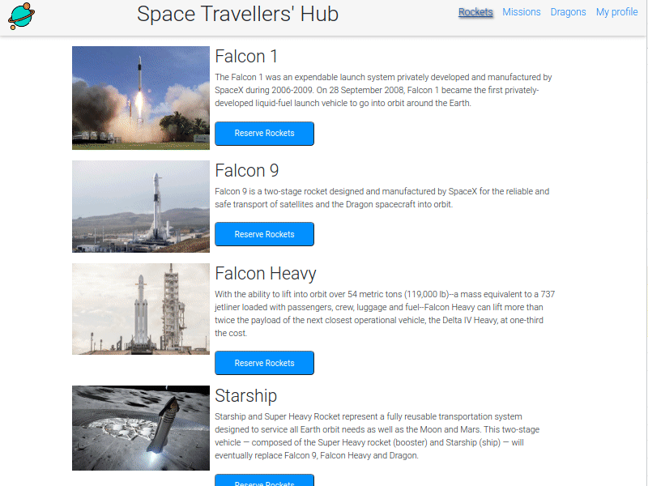

# Spaces Traveler's Hub

> Web application that allows users to book rockets and join selected space missions using real live data from the SpaceX API

## Live Demo

## Table of Contents

- [Description](#description)
- [Built With](#built-with)
- [Getting Started](#getting-started)
  - [Setup](#setup)
- [Scripts](#scripts)
  - [Start dev server](#start-dev-server)
  - [Build for production](#Build-for-production)
  - [Locally preview production build](#Locally-preview-production-build)
- [Show Your Support](#how-your-support)
- [Acknowledgments](#acknowledgments)
- [License](#license)

## Description

Spaces Travellers Hub is the React group project from the Microverse Curriculum. You can:

- Add or cancel a rocket.
- Add or cancel a mission.
- Add or cancel a dragon.

## Built With

- [Create React App](https://create-react-app.dev/) Set up a modern web app by running one command.
- [React Router](https://reactrouter.com/) A declarative library for building single page applications.
- [Redux](https://redux-toolkit.js.org/) The official, opinionated, batteries-included toolset for efficient Redux development.
- [Bootstrap](https://getbootstrap.com/) Build fast, responsive sites with Bootstrap.

## Getting Started

To get a local copy up and running follow these simple example steps.

### Prerequisites

- `node` : `^12 || >=14`
- `npm` or `yarn`

### Setup

1. Download or fork this project
2. Extract the content to a new directory, rename it and cd the directory.
3. Install all dependencies using:

- `npm install` or `yarn`

## Scripts

### Start dev server

- `npm start` or `yarn start` and open the browser at `http://localhost:3000`

### Build for production

- `npm run build` or `yarn run build`

### Locally preview production build

After creating the production build, run:

- `npm run preview` or `yarn run preview` and open the browser at `http://localhost:5000`

## Connect With Us

👤 **Reem**

 Platform | Badge |
 --- | --- |
 **GitHub**  | [@Reem-lab](https://github.com/Reem-lab)
 **Twitter** | [Rem79940127](https://twitter.com/Rem79940127)
 **LinkdIn** | [reem-janina](https://www.linkedin.com/in/reem-janina-ab74ab21a/)

👤 **Eduardo**

 Platform | Badge |
 --- | --- |
 **GitHub**  | [@eduardosancho](https://github.com/eduardosancho)
 **Twitter** | [@sanchitobless](https://twitter.com/sanchitobless)
 **LinkedIn** | [Eduardo](https://www.linkedin.com/in/eduardo-sancho-043641181/)

👤 **Fabricio**

Platform | Badge |
 --- | --- |
 **GitHub**  | [@fabgrel10](https://github.com/fabgrel10)
 **Twitter** | [@fabgrel10](https://twitter.com/fabgrel10)
 **LinkedIn** | [@fabgrel10](https://www.linkedin.com/in/fabgrel10/)

## Show your support

Give a ⭐️ if you like this project!

## Acknowledgments

The ideas and inspiration from this project are coming from the following articles:

- Microverse

## License

This project is [MIT](./MIT.md) licensed.